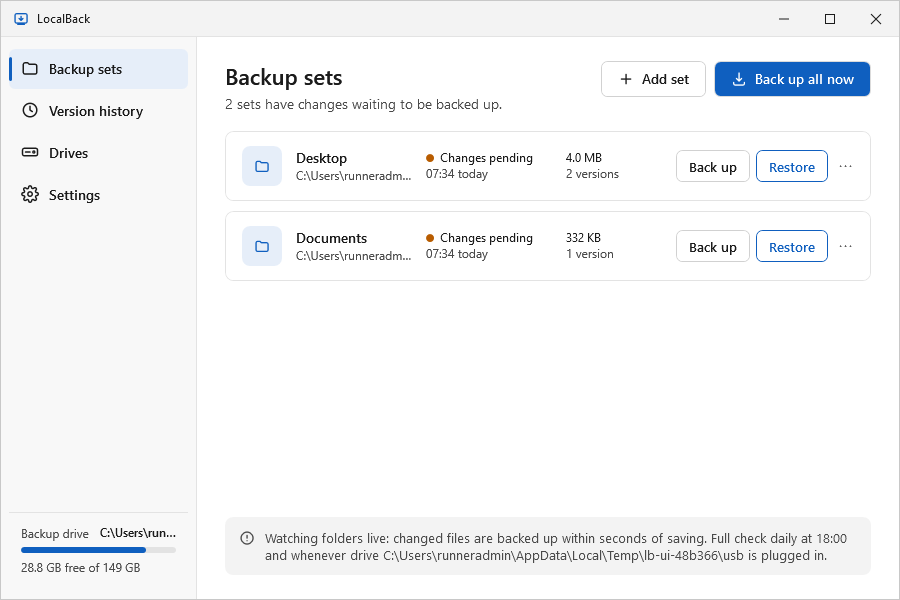
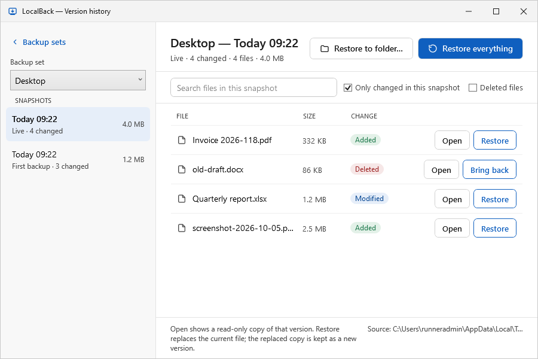
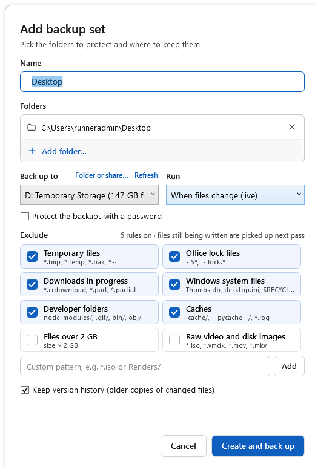
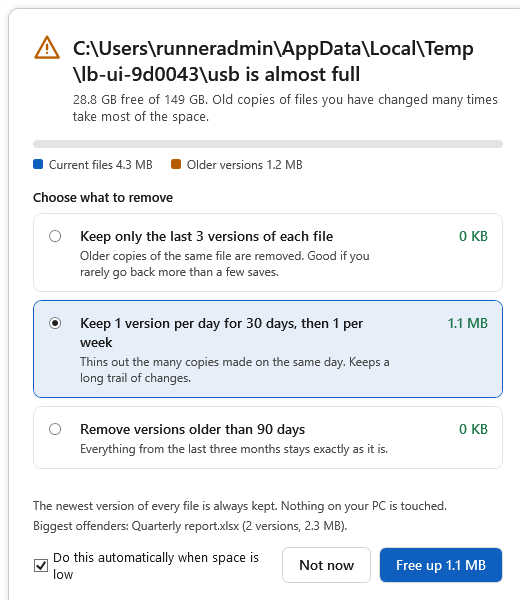
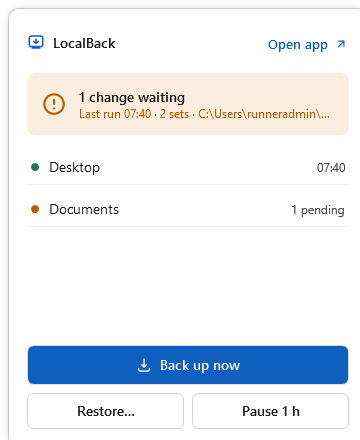
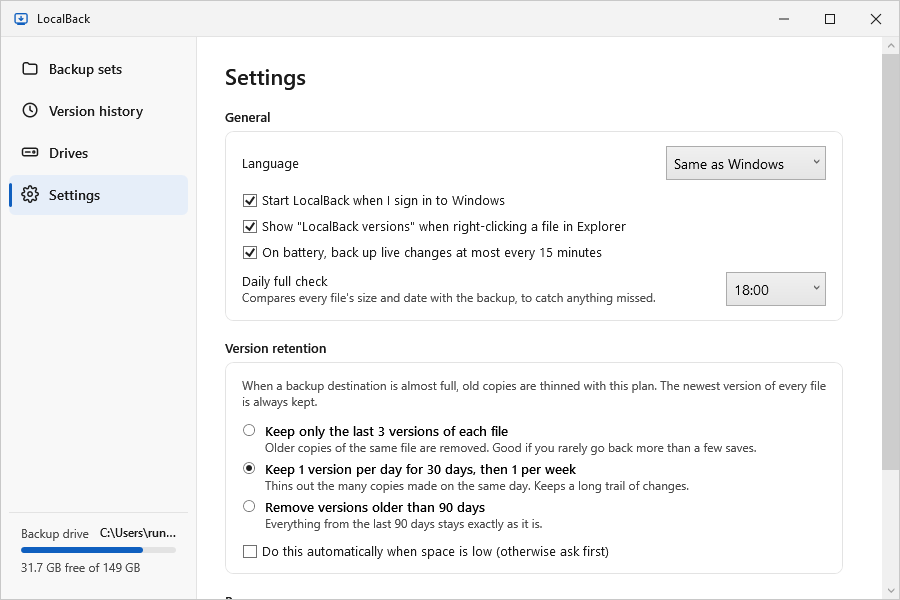

# LocalBack

A small Windows tray app that keeps a versioned backup of chosen folders on an external HDD or pendrive, and brings any file or folder back with one click.

## What it does

- Watches folders live (Desktop, Documents, project dirs) and backs up changed files within seconds of saving.
- Keeps a version history of every file; open any old version read-only, or restore it in place.
- Backs up to any external drive, including FAT32/exFAT pendrives. Runs automatically when the drive is plugged in.
- Stays out of the way: debounced change detection, temp-file exclusions, metadata-only rescans, low-priority I/O.
- Warns when the drive is almost full and offers to thin out old copies of the same file.

## Design

`design/` holds the UI mockups, made with the Claude Design canvas. Each screen is one self-contained `.dc.html` file; `canvas.json` lays them out.

| Screen | File |
| --- | --- |
| Main window: backup sets | `design/screens/Main.dc.html` |
| Version history and restore | `design/screens/History.dc.html` |
| Tray flyout | `design/screens/Tray.dc.html` |
| Add backup set dialog | `design/screens/AddSet.dc.html` |
| Free up space dialog | `design/screens/FreeSpace.dc.html` |

Look: Windows-native (Segoe UI, flat panels, single blue accent `#0F5FBF`). Status colours: green `#1F7A4D` up to date, amber `#B85C00` pending/warning, red `#A12A2A` deleted.

## Screenshots

The real app, rendered on Windows by the UI test (`docs/screenshots/`, refreshed by any commit whose message contains `[screenshots]`).

| | |
| --- | --- |
|  |  |
|  |  |
|  |  |

## Stack

- **.NET 8, C#.** WPF for the windows, created lazily and disposed on close; WinForms `NotifyIcon` for the tray. Published self-contained, single-file, ReadyToRun (WPF cannot be trimmed). Target ~25 MB RAM idle.
- **Engine:** content-addressed blob store on the backup drive + JSON manifests per snapshot + SQLite index on the PC. See `docs/ARCHITECTURE.md` and `docs/BRIEF.md`.
- Alternative if size matters more than ship date: Rust (`tray-icon`, `notify`, `rusqlite`, `blake3`) with egui or Tauri 2.

## Status

All six milestones are implemented: engine, live watching, tray and main window, version history, retention and Free up space,
and polish (autostart, Explorer menu, single-file build, per-user installer, idle memory trimming).

Not yet done: use by a person on a real desktop with a real USB drive. Everything else runs in CI on Windows (see Testing).

## Code

```
LocalBack.sln
src/
  LocalBack.Core/     engine, cross-platform (net8.0)
    Storage/          blob store, manifests, snapshot list, drive layout
    Indexing/         SQLite index on the PC
    Scanning/         exclusion rules, metadata-only folder walk
    Engine/           backup, restore, open old version
    Retention/        retention plans, exact preview, garbage collection
    Watching/         FileSystemWatcher + debounce
    Drives/           find drives by identity, not letter
    Service/          background service: queue, schedule, pause, low space, status
  LocalBack.App/      WPF tray app (net8.0-windows)
  LocalBack.Cli/      `localback-cli` command line, same settings and index as the app
tests/
  LocalBack.Core.Tests/   engine and service tests (any OS)
  LocalBack.App.Tests/    Windows: opens every screen, registry, tray icon, single instance
installer/LocalBack.iss   Inno Setup script: per-user install, no admin
tools/make_icon.py        regenerates Assets/LocalBack.ico
```

## Build and run

Needs the .NET 8 SDK. The app builds on Windows only; the engine, CLI and tests build anywhere.

```
dotnet test tests/LocalBack.Core.Tests          # engine tests
dotnet run --project src/LocalBack.App           # tray app (Windows)
dotnet publish src/LocalBack.App -c Release -r win-x64 --self-contained -o publish
```

Installer (Windows, Inno Setup 6):

```
dotnet publish src/LocalBack.Cli -c Release -r win-x64 --self-contained -p:PublishSingleFile=true -o publish/cli
copy publish\cli\localback-cli.exe publish\LocalBack\
iscc installer\LocalBack.iss /DAppVersion=0.1.0      # -> publish\LocalBack-Setup-0.1.0.exe
```

It installs to `%LOCALAPPDATA%\Programs\LocalBack` without admin rights. Uninstalling removes the autostart and Explorer entries and keeps settings and all backups.

## Testing

`.github/workflows/build.yml`, on every push:

1. Engine and service tests on Windows and Linux.
2. Builds the app, then opens every screen against a real backup set (catches XAML and binding errors at run time).
3. Windows integration tests: autostart and Explorer registry entries, tray icon in every state, the device-change window, single-instance hand-off.
4. Smoke test of the published `LocalBack.exe`: starts it in the tray with a real set, saves a file and checks the live backup, launches it a second time with `--history` and checks the hand-over, and reports memory (idle in the tray: 6 MB working set, 28 MB committed; see `docs/ARCHITECTURE.md`).
5. Builds the installer, installs and uninstalls it silently.

Artifacts: `LocalBack-win-x64` (app + CLI), `LocalBack-Setup` (installer), `screenshots`.

App command line: `LocalBack.exe --tray` (start hidden, used by autostart), `LocalBack.exe --history <path>` (used by the Explorer menu).

## Command line

```
localback-cli drives
localback-cli add --name Desktop --drive E:\ --folder %USERPROFILE%\Desktop
localback-cli backup [SET]
localback-cli snapshots SET
localback-cli files SET [SNAPSHOT] [--changed]
localback-cli restore SET SNAPSHOT [--file PATH]... [--to FOLDER]
localback-cli versions PATH
localback-cli prune SET --plan last:3|daily|older:90 [--apply]
localback-cli watch
```

Settings and the index live in `%LOCALAPPDATA%\LocalBack` (override with `LOCALBACK_HOME`).

Commands that write (`add`, `backup`, `restore`, `prune`, `remove`, `watch`) need the tray app to be closed: only one process may run the engine on the same index and drive. Read-only commands work alongside it.

## Decisions made while building

- **Manifests are gzip-compressed** (`*.json.gz`). Every snapshot lists every file, so this keeps live snapshots of large sets small on the drive.
- **`snapshots.jsonl`** next to the manifests caches one summary line per snapshot, so the history list does not open every manifest. It is rebuilt from the manifests if it is missing or stale.
- **`drive.json`** gives each backup drive an id. Drives are matched by that id or by volume serial, never by letter.
- **Snapshots are only written when content changed.** Touching a file without changing it updates the index, not the history.
- **Restore everything leaves files that were added later alone**, and snapshots what it overwrites first, so it can be undone.
- **Auto-prune is a standing policy** (Settings → Version retention), answering the first open question in the brief.
- **On battery**, live changes are batched to at most one run every 15 minutes (Settings, on by default).
- **Trimming is off**: WPF does not support it. The build is self-contained, single-file, ReadyToRun and compressed instead.
